# 《C++程序设计基础》作品

## 一，疫情人员管理

### 完整代码

### 核心实现原理

1. 从文件中读取一个学生的信息后，用字符数组储存学生信息，getline()每次读取到空格，最后读取到换行符‘\n’，最后讲读取到的信息储存到Student类里，并加入到链表中，将每一个学生信息都串起来

2. 在Student类里使用strcpy()赋值到Student()类里。

3. 第一个功能：根据姓名查询学生健康码和核酸状况；通过我写的getColor(char*)函数传入想要查询的学生姓名，运用链表指针，遍历寻找进入到func()函数判断符合条件的学生，输出该学生的健康码颜色以及是否做核酸。

4. 第二个功能：显示所有未做核酸检测的学生信息；进入displayUndoing()函数，仍是用链表指针持续遍历，为否的学生输出该学生信息，通过断点遍历发现中文“否”字符值为-73因此(p->f[0]==-73)判断

5. 第三个功能：根据健康码状态将人员数据储存到各个文件；通过写三个判断健康码颜色，通过断点遍历发现红码，绿码，黄码在字符数组中分别为以下形式储存：

   绿码：-62,-52,-62,-21,\0; 红码： -70,-20,-62,-21,'\0'；绿码：-62,-52,-62,-21,\0

   因此,利用这些数值判断每位学生健康码，存入相应的文件中。

### 流程设计

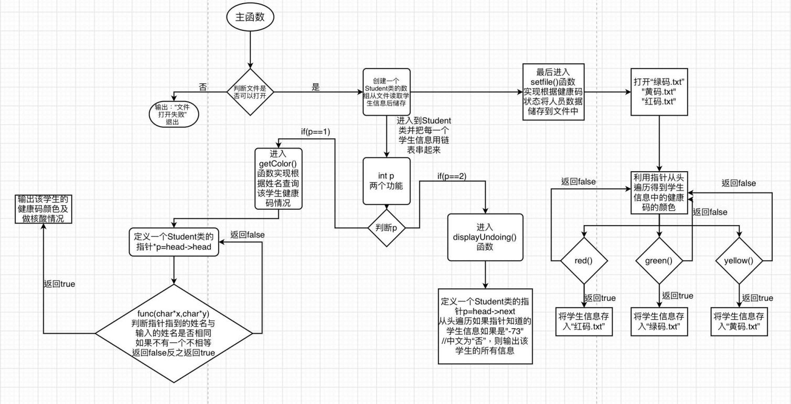

### 结果截图及说明

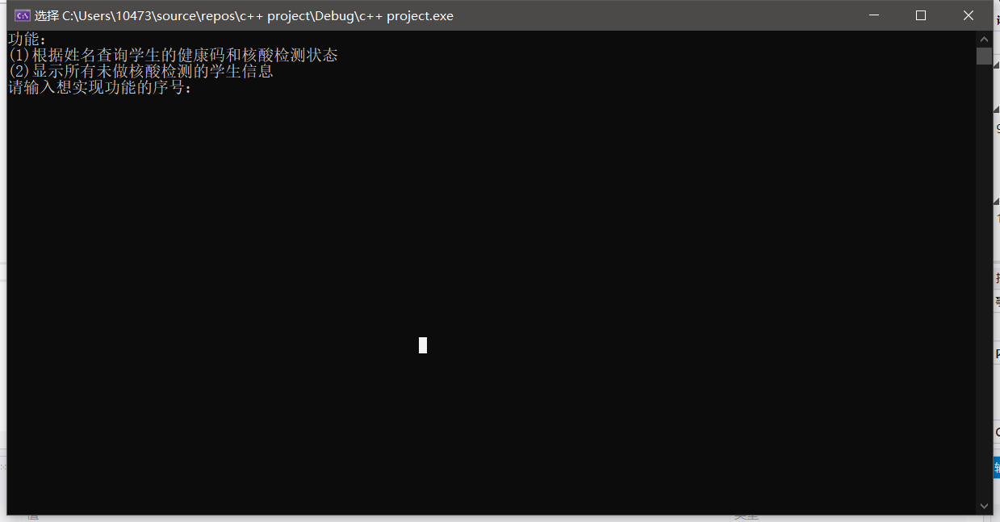

输入1 张三

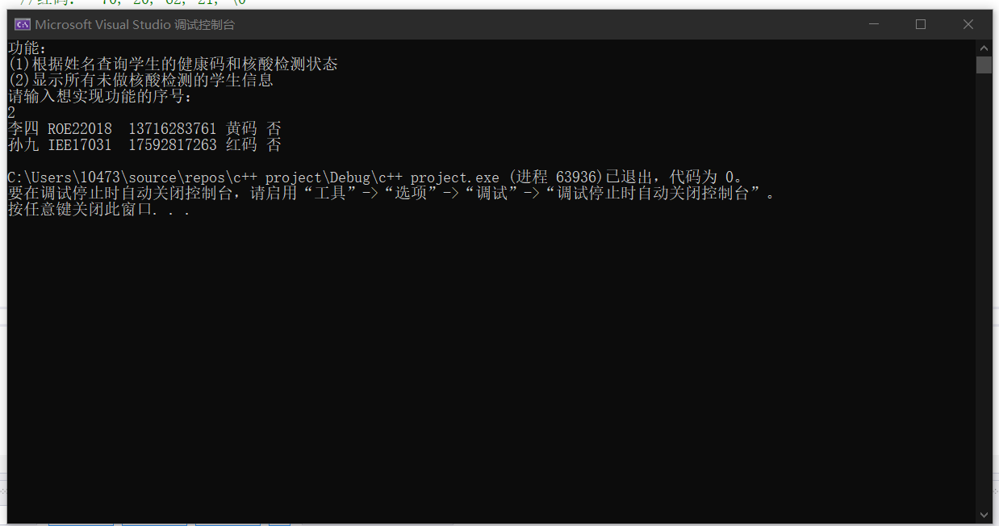

输入2

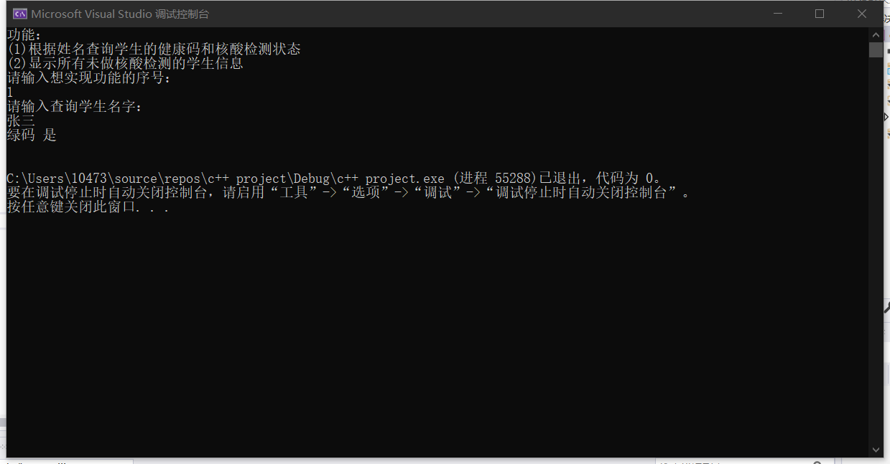

红码文件：

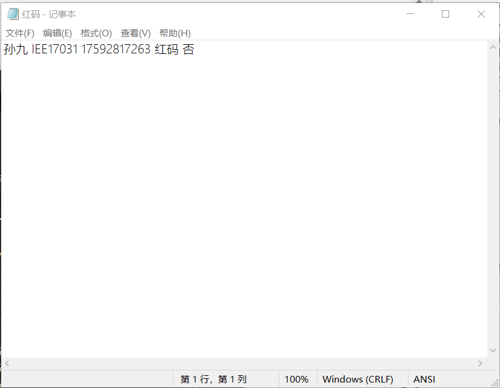

黄码文件：

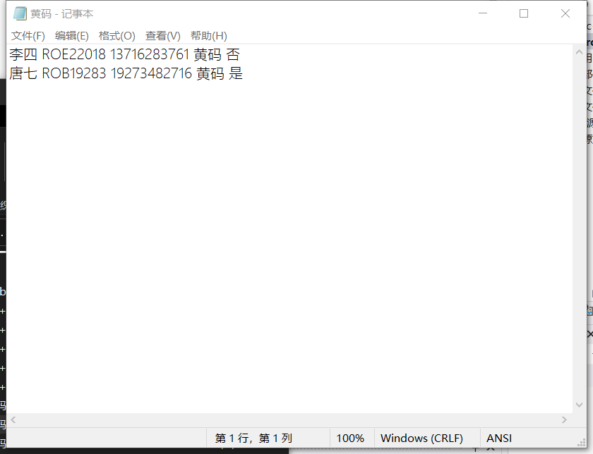

绿码文件：

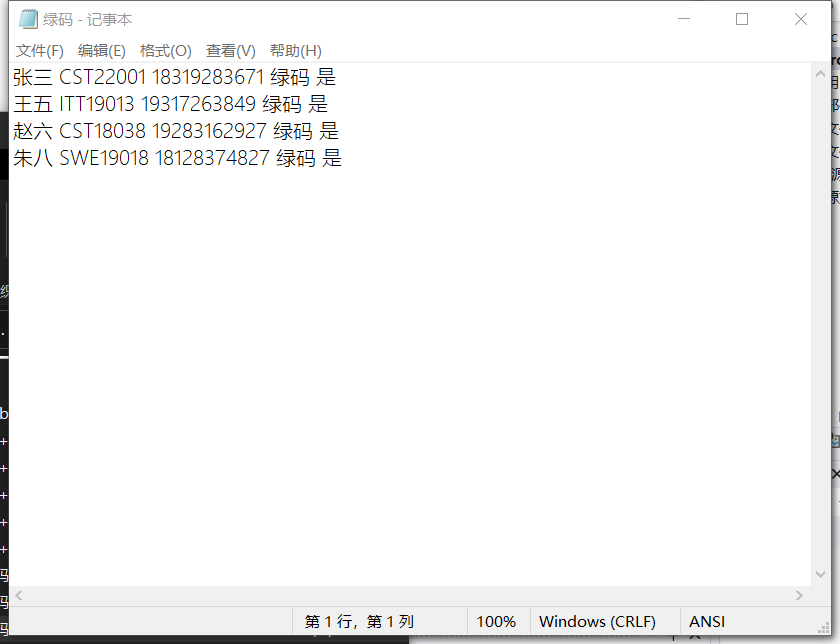

### 设计体会

写完成就感满满，真棒！

## 二、实现一个文本处理类TXTManager

### 完整代码

### 流程设计

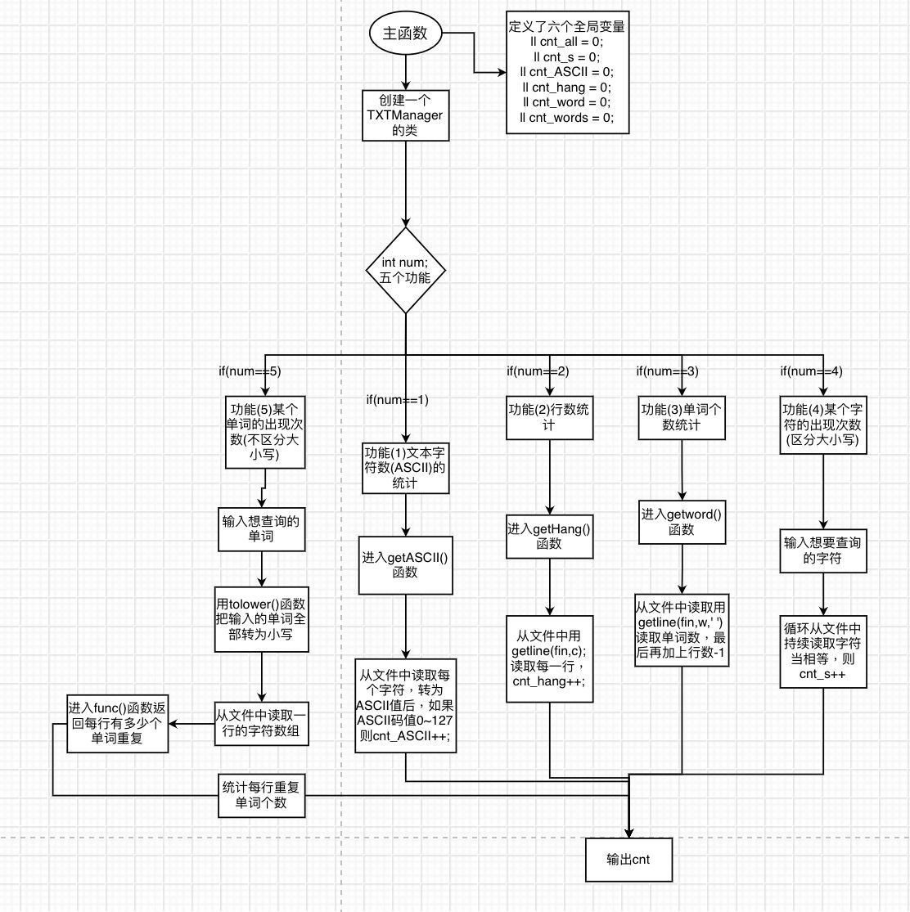

### 核心实现原理

1. 功能(1)文本字符数(ASCII)的统计:用while(fin>>a)读取一个字符,判断每个字符是否在ASCII范围内;

2. 功能(2)行数统计:用while(fin.peek()!=EOF)退出循环,每次循环读取一行,cnt_hang++;

3. 功能(3)单词个数统计:仍是while(fin.peek()!=EOF)退出循环,每次循环读取一行,进入getwords(char*)函数获取每一行的单词个数，每个字符判断只要是’ ’cnt++;或者’\0’就cnt++;且返回cnt值;

4. 功能(4)某个字符的出现次数:从文件读取每一个字符与输入字符对比，相同就cnt_s++;

5. 功能(5)某个单词的出现次数:首先是从文件中读取一行的字符;进入func(char*,char*)函数返回每行符合输入单词的个数;进入循环，先把传入一行的字符用tolower()函数转成小写，如果改字符为’a’~’z’则存入字符串中，若读取行字符为’ ’||’\n’就进入judge(string,char*)判断文件这一行所得单词是否跟输入单词一样，是返回true，cnt++;否则返回false；然后用erase()函数清空字符数。经过遍历得出当一行有效字符读取完后会出现负数，因此当读取字符为负数是返回cnt的值。

### 结果截图及说明

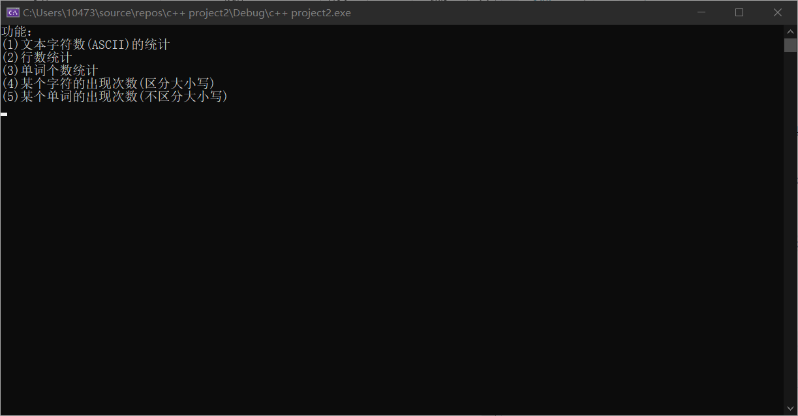

输入1：

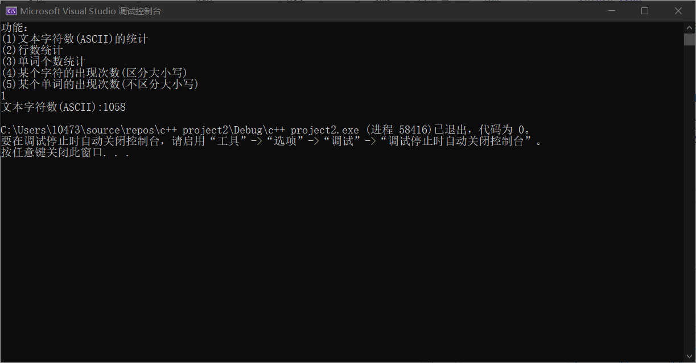

输入2：

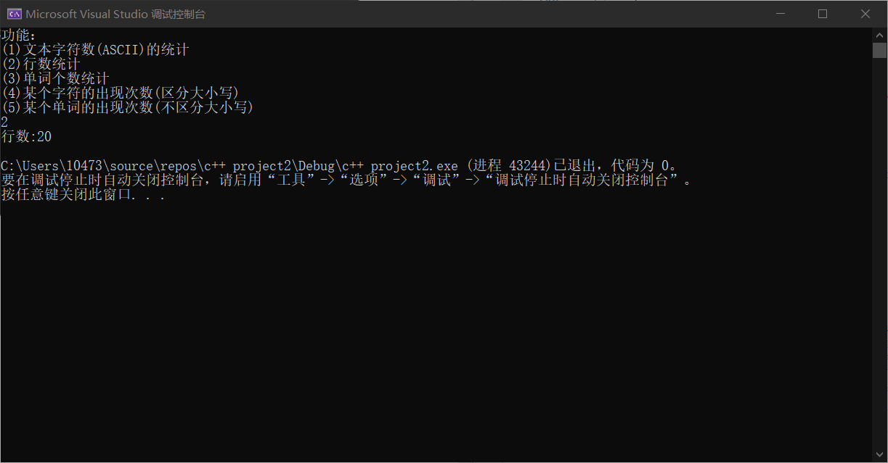

输入3：

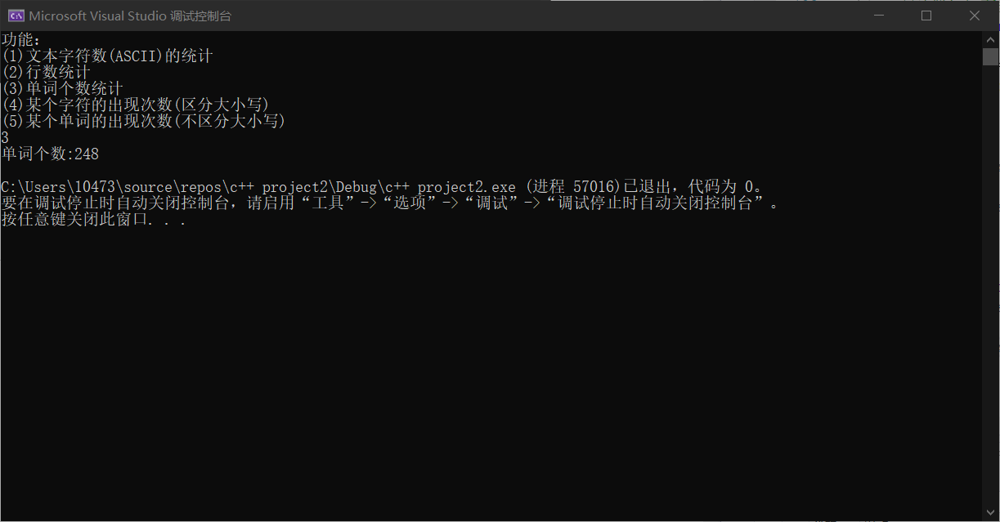

输入4 a：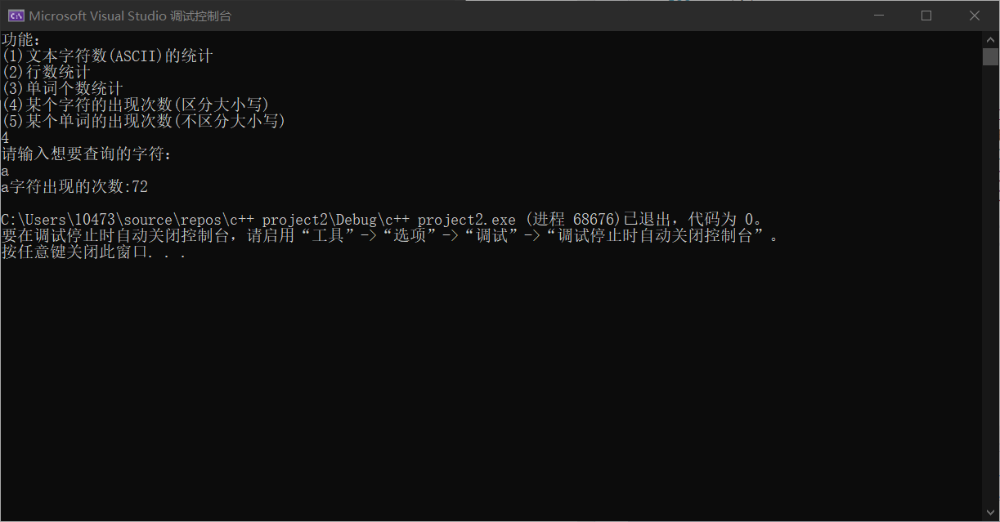

输入5: youth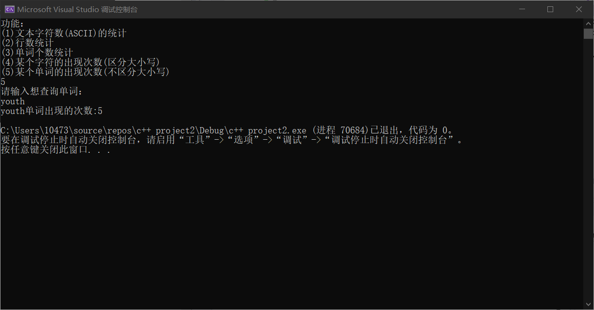

### 设计体会

很考验思维能力，运用多个函数，指针实现代码。

### 三、图像处理

### 完整代码

### 流程设计

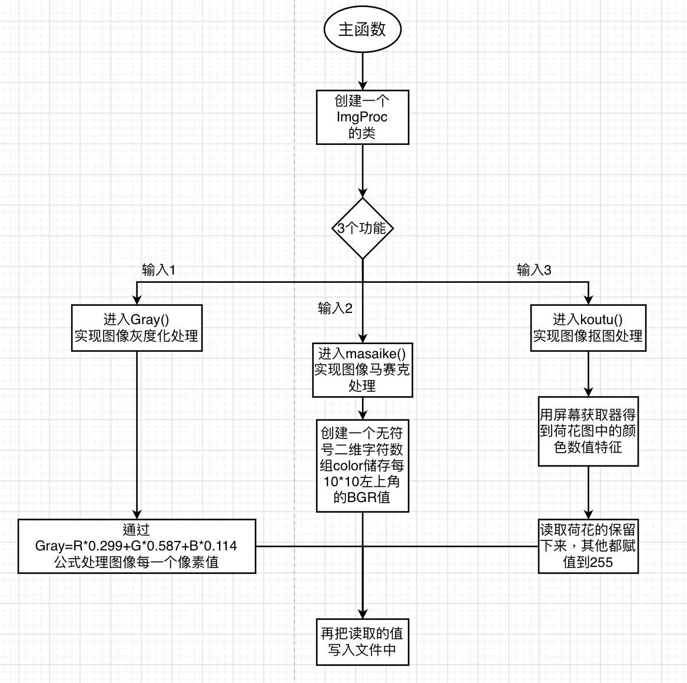

### 核心实现原理

1. 功能(1)图像灰度处理：首先把前54位文件头读写入文件，进入循环，每次读取一个像素点的BGR三个值，通过Gray=R*0.299 + G*0.587 + B*0.114公式处理后，写入文件中

2. 功能(2)图像马赛克处理：首先把前54位文件头读写入文件，利用无符号二位字符数组储存每10*10的矩阵左上角的像素值，通过计算该图像w*h=700*700;因此通过循环，如果行数i%10==0,则进入列的循环，如果j%10==0；则通过计算得出以下公式a=i/10*3;b=j/10;m=a*21+b;则计算出的m储存到color[m][0]…中；其余就向后每次移动3位指针；最后再通过公式写入文件中c = i / 10 * 3;d = j / 10 ;m = c * 21 + d;

3. 功能(3)图像抠图处理：首先把前54位文件头读写入文件，通过屏幕颜色获取可知在荷花位置R的值都比G和B的值大且绿叶深色区域总体值会比较小且G的值比B.R大，根据这些判断深色就把BGR三个值改为255，荷花区域直接写入，最后实现抠图。

### 结果截图及说明

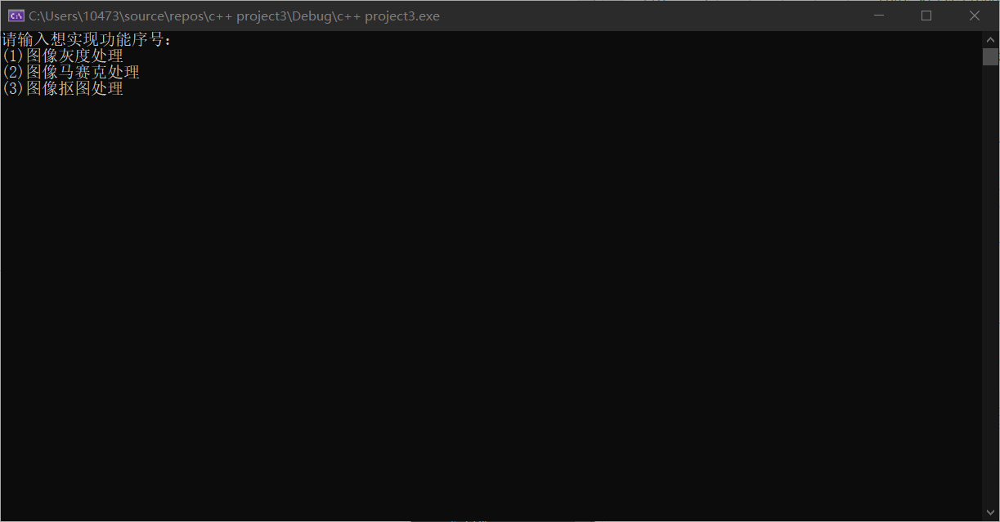

原图：

输入1：//功能(1)灰度处理：

输入2：马赛克处理

原图：

输入3：//抠图

### 设计体会 

公式的总结，让我有一种很高能的感觉！很酷！

# cpp-final_exam
